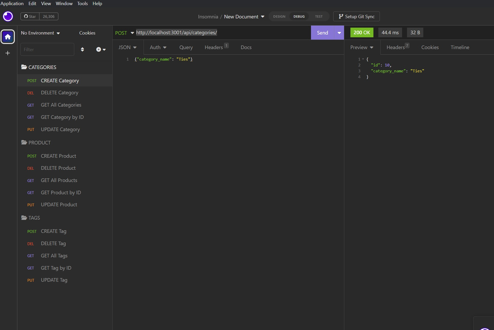

# E-Commerce-Back_End
A back end for an e-commerce site with a working Express.js API to use Sequelize to interact with a MySQL database.

## Description

E-Commerce-Back_End provides a manager at an internet retail company, a back end for their e-commerce website that uses the latest technologies so that their company can compete with other e-commerce companies

The application is build with followig features:
* An environment variable file is used to store the database name, MySQL username, and MySQL password whic is then used to connect to a database using Sequelize in functional Express.js API.
* The application provides the user with schema and seed commands so that a development database is created and is seeded with test data
* When the user enters the command to invoke the application then the server is started and the Sequelize models are synced to the MySQL database
* The user is able to successfully create, update, and delete data in the database for categories, products, or tags using the following routes:
  * Categories
    * CREATE a Category 
    * GET All Categories
    * GET Category by ID
    * UPDATE a Category
    * DELETE a Category
  * Products
    * CREATE a Product
    * GET All Products
    * GET Product by ID
    * UPDATE a Product
    * DELETE a Product
  * Tags
    * CREATE a Tag
    * GET All Tags
    * GET Tag by ID
    * UPDATE a Tag
    * DELETE a Tag

## Technology Used

* Uses the [express package](https://www.npmjs.com/package/express).
* Uses the [mysql2 package](https://www.npmjs.com/package/mysql2) 
* Uses the [sequelize package](https://www.npmjs.com/package/sequelize) 
* Uses the [dotenv package](https://www.npmjs.com/package/dotenv) 

## Installation

  To install necessary dependencies, run the following command:
  ```
  npm i
  ```
  To install necessary database, schema and seed data, run the following commands in mysql2 CLI:
  ```
  source db/schema.sql
  ```
  Create an .env file
  ```
  Rename .env_example file to .env
  Add the database name and your username and password for mysql server in the.env file
  ```
  To create the seed data, do the following steps:
  ```
  npm run seed
  ```
  Run the server using the following command:
  ```
  node server
  ```
  

### Database Models

The databse contains the following four models:

* `Category`

  * `id`

    * Integer.
  
    * Doesn't allow null values.
  
    * Set as primary key.
  
    * Uses auto increment.

  * `category_name`
  
    * String.
  
    * Doesn't allow null values.

* `Product`

  * `id`
  
    * Integer.
  
    * Doesn't allow null values.
  
    * Set as primary key.
  
    * Uses auto increment.

  * `product_name`
  
    * String.
  
    * Doesn't allow null values.

  * `price`
  
    * Decimal.
  
    * Doesn't allow null values.
  
    * Validates that the value is a decimal.

  * `stock`
  
    * Integer.
  
    * Doesn't allow null values.
  
    * Set a default value of `10`.
  
    * Validates that the value is numeric.

  * `category_id`
  
    * Integer.
  
    * References the `Category` model's `id`.

* `Tag`

  * `id`
  
    * Integer.
  
    * Doesn't allow null values.
  
    * Set as primary key.
  
    * Uses auto increment.

  * `tag_name`
  
    * String.

* `ProductTag`

  * `id`

    * Integer.

    * Doesn't allow null values.

    * Set as primary key.

    * Uses auto increment.

  * `product_id`

    * Integer.

    * References the `Product` model's `id`.

  * `tag_id`

    * Integer.

    * References the `Tag` model's `id`.

### Associations

* `Product` belongs to `Category`, and `Category` has many `Product` models, as a category can have multiple products but a product can only belong to one category.

* `Product` belongs to many `Tag` models, and `Tag` belongs to many `Product` models. Allow products to have multiple tags and tags to have many products by using the `ProductTag` through model.


## Mock-Up

Demo of Project: [Demo on Google Drive](https://drive.google.com/file/d/12XpBGXIgpQ7tN8l1EHGNny69JTAAhiTV/view?usp=sharing)  OR
[File in Project](./assets/images/eCommerceBackEnd.mp4)

Application Screenshot:



## Usage
1. You can access the file in GitHub repository: https://github.com/rbhumbla1/E-Commerce-Back-End
2. Run the application in the terminal using this command: 
```
node server
```
3. You can access the routes using the insomnia

## License
None

## Contributing

Contact owner

## Questions

  If you have any questions about the repository and project, or would like to open an issue or would like to contact me for contributing or any other subject, you can do so at rima.bhumbla@gmail.com. You can welcome to see more of my work at https://github.com/rbhumbla1.

